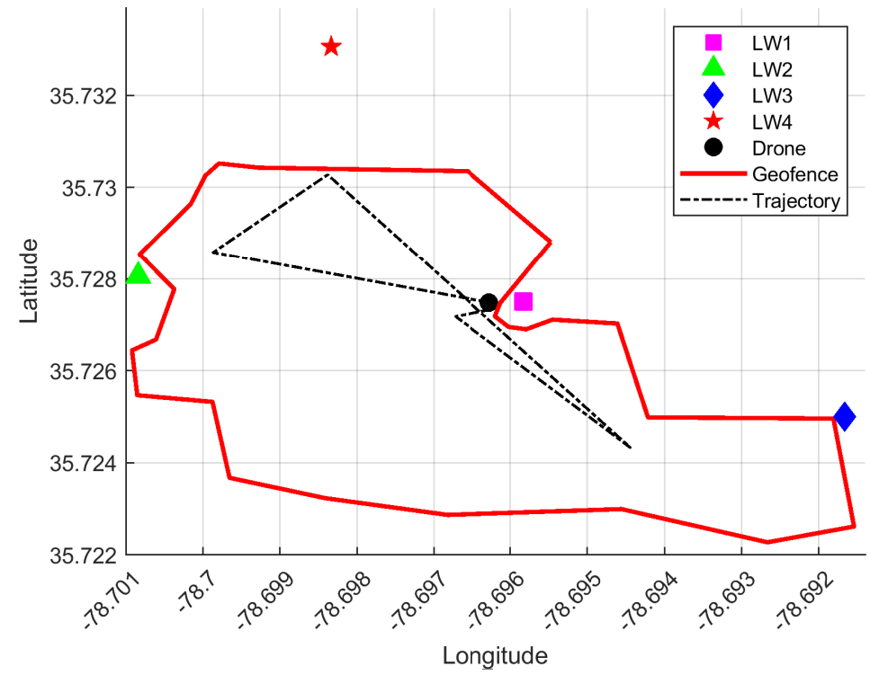

# UAV Wireless Network Digital Twin Simulation Framework

We have developed a **measurement-calibrated MATLAB-based simulation framework** designed to replicate performance in a full-stack **UAV wireless network digital twin (DT)**. 

In particular, we use the DT from the [NSF AERPAW platform](https://aerpaw.org/) and compare its reports with those generated by our developed simulation framework in wireless networks with similar settings. 

## Features
- **Fixed and Autonomous UAV Trajectories** with a geofence.
- Two separate projects for better organization.
- MATLAB-based implementation.

---

## How to Run the Fixed Trajectory

1. Navigate to the folder **`Fixed Trajectory`**.  
2. Run the MATLAB script:  
   ```matlab
   main_fixed_trajectory.m

---

## How to Run the Autonomous Trajectory

1. Navigate to the folder **`Autonomous Trajectory`**.  
2. Run the MATLAB script:  
   ```matlab
   main_auto_traj.m

## Sample Visualizations  

To compare the **fixed trajectory** and **autonomous trajectory**, see the sample outputs below:  

| **Fixed Trajectory** | **Autonomous Trajectory** |
|----------------------|--------------------------|
|  |  |

## Accepted Paper link
This paper has been accepted for WS24: Workshop on Digital Twins over NextG Wireless Networks at the IEEE International Conference on Communications (ICC), 8–12 June 2025, Montreal, Canada, Communications Technologies 4Good. It is available [here](https://arxiv.org/abs/2503.07935)
