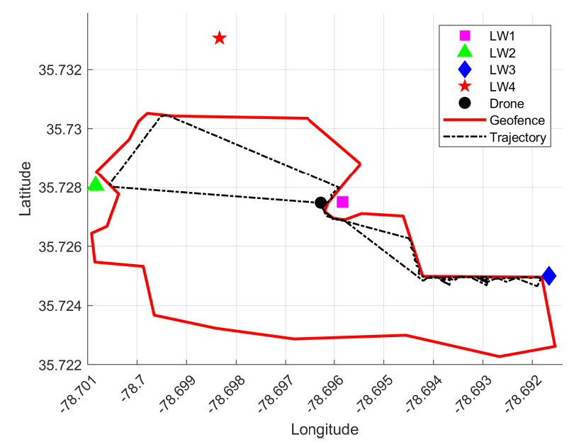

We have developed a measurement-calibrated Matlab-based simulation framework designed to replicate performance in a full-stack UAV wireless network DT. In particular, we use the DT from the NSF AERPAW platform, and compare its reports with those generated by our developed simulation framework in
wireless networks with similar settings. 

We implemented fixed and autonomous trajectory in two separate folder.

**How to run the fixed trajectory**

Go to the folder 'Fixed Trajectory'. Run the file "main_fixed_trajectory.m"

**How to run the fixed trajectory**

Go to the folder 'Autonomous Trajectory'. Run the file "main_auto_traj.m"

